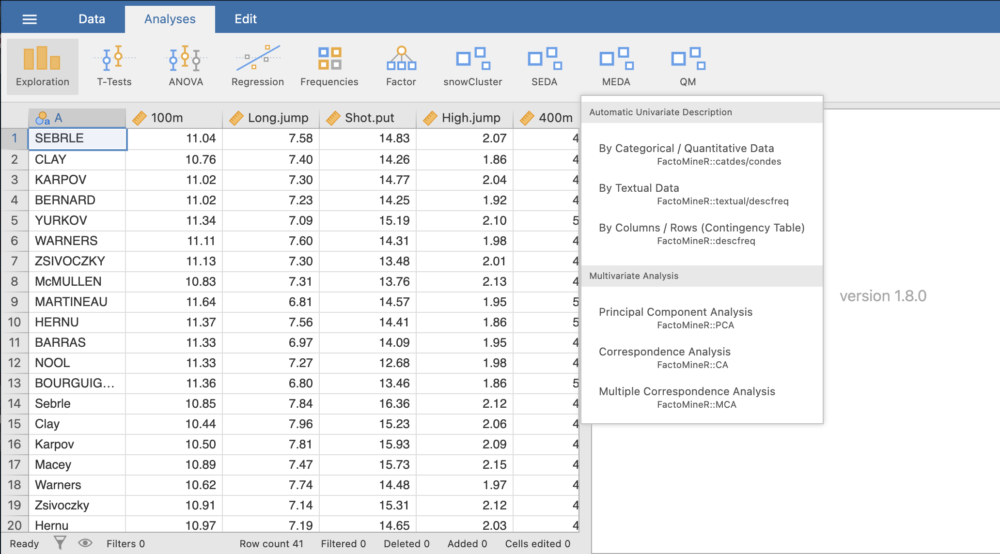

MEDA is jamovi module for multivariate exploratory data analysis methods such as Principal Components Analysis, Correspondence Analysis, Multiple Correspondence Analysis. Alongside those main methods, three other methods have been added to the modules: the description of a categorical or a continuous variable by categorical and continuous variables, the description of a categorical variable with a textual variable and finally, the description of a contingency table.

This tutorial was mostly written by Maxime Saland.

<!-- For more information about simple R Markdown websites, please read the documentation at https://bookdown.org/yihui/rmarkdown/rmarkdown-site.html. -->

<!-- Please also note that simple R Markdown sites are _not_ based on **blogdown**. They are probably good for websites with only a few Rmd documents. For larger-scale and more sophisticated websites (such as blogs), you may want to use **blogdown** instead: https://github.com/rstudio/blogdown. -->


```{r MenuMEDA, out.width="80%", fig.align="left", echo=FALSE}
#
```
<br><br />

Links to the user guide for each of those methods are available below.
<br><br />
For the **Automatic Univariate Description** methods:

* [Description of a categorical or continuous variable](catdes.html)
* [Description of a categorical variable by a textual variable](descfreq.html)
* [Description of a contingency table](textual.html)

For the **Multivariate Analysis** methods:

* [Principal Component Analysis](PCA.html)
* [Correspondence Analysis](CA.html)
* [Multiple Correspondence Analysis](MCA.html)
